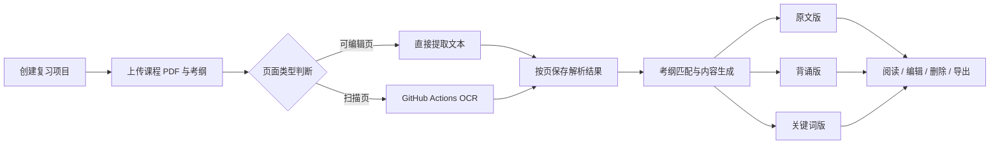
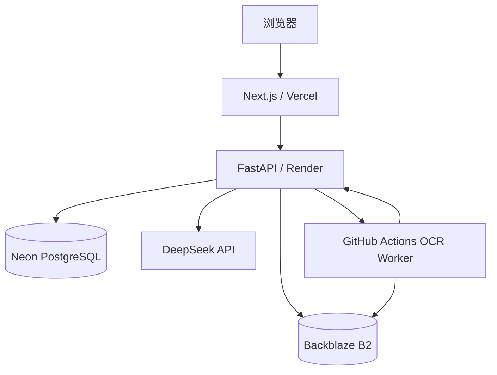

# Revia

> 面向大学课程考试复习的 AI 学习资料整理工具：结合课程 PDF 与考纲，生成原文版、背诵版和关键词版复习材料。

<p>
  <a href="https://revia-jade.vercel.app"><strong>在线体验</strong></a>
  ·
  <a href="./docs/PRD.md">产品需求</a>
  ·
  <a href="./docs/TECH_SPEC.md">技术方案</a>
  ·
  <a href="./docs/INTERACTION_SPEC.md">交互设计</a>
</p>


## 项目简介

大学课程复习往往需要同时处理数十到数百页课件、教材和补充资料。传统 AI 工具面对长 PDF 时，常常需要用户手动拆分文件、重复上传，再自行整理多轮输出。

Revia 将这一过程整理为一条完整工作流：

1. 创建课程复习项目；
2. 上传课程 PDF，并填写或上传考纲；
3. 自动解析可编辑 PDF，对扫描页执行 OCR；
4. 根据考纲筛选考试相关内容；
5. 生成三种信息密度的复习材料；
6. 在学习页阅读、编辑、删除并导出个人复习资料。

Revia 的目标不是生成一次性摘要，而是把原始课程资料转化为可以持续阅读、修改和复习的结构化内容。

## 核心功能

### 基于考纲提取重点

系统结合课程资料与考试范围，筛选和组织与考试相关的章节、知识点和要点，减少无关内容。

### 三层复习材料

同一个知识要点生成三个互相关联的版本：

- **原文版**：保留知识背景与完整表达，用于理解；
- **背诵版**：整理为更适合记忆和考试作答的内容；
- **关键词版**：压缩为记忆线索，用于考前回忆与自测。

### 长 PDF 与扫描 PDF

- 可编辑 PDF 直接提取文本；
- 纯扫描页和混合 PDF 的扫描页自动进入 OCR；
- OCR 任务由 GitHub Actions Worker 执行，避免占用 Render 免费实例的有限内存；
- 每页结果独立保存，长文档失败后可以从首个未完成页面继续；
- 同一文档只允许一个活动任务，避免重复识别和重复写入。

### 连续阅读与内容编辑

学习页采用连续长文阅读，而不是碎片化卡片。用户可以：

- 在原文版、背诵版、关键词版之间切换；
- 通过目录快速定位章节；
- 点击关键词查看对应背诵内容；
- 编辑单个版本或同时编辑三个版本；
- 删除不需要的知识要点；
- 导出 Word 文档。

### 项目与上传管理

- 按课程创建多个复习项目；
- 上传课程资料与考纲；
- 开始生成前可删除误选 PDF；
- 查看处理状态与页级进度；
- 失败后保留原 PDF 和已完成进度，手动继续识别；
- 删除不再需要的项目。

## 使用流程



## 系统架构



各部分职责：

- **Next.js / Vercel**：页面、会话代理、项目创建、上传与学习交互；
- **FastAPI / Render**：业务 API、任务状态、文档调度、内容生成；
- **Neon PostgreSQL**：项目、文档、页级进度、知识结构和用户编辑结果；
- **Backblaze B2**：私有保存待处理原 PDF，浏览器通过短期签名地址直传；
- **GitHub Actions**：执行扫描页 OCR，并按页回传结果；
- **DeepSeek**：考纲匹配与三版本复习材料生成。

## 技术难点与解决方案

### 1. 在低内存后端上处理扫描 PDF

Render 免费实例无法稳定承载大型 OCR 模型和长扫描 PDF。Revia 将重型 OCR 从 Web Service 中拆出，通过 `workflow_dispatch` 启动 GitHub Actions Worker。

Worker 只接收文档 ID 和任务 ID，从后端领取短期下载地址，完成识别后逐页回传，不在 GitHub 参数或日志中暴露 PDF 签名地址。

### 2. 长文档断点续跑

解析结果按页持久化。任务异常退出后，系统保留：

- 原始 PDF；
- 已完成页数；
- 页级文本与章节信息；
- 当前失败原因。

用户手动继续时，从首个未完成页面恢复，不重新 OCR 已完成页面。

### 3. 防止重复任务与过期回传

每次处理都绑定独立 attempt ID，并对文档设置活动任务约束。旧任务、过期任务或重复回传无法覆盖新任务结果。

GitHub Actions 还按文档 ID 设置并发组，确保同一文档不会同时运行两个 OCR Job。

### 4. 私有文件直传

浏览器通过后端签发的短期 Presigned PUT URL，将 PDF 直接上传到私有 Backblaze B2 Bucket。对象存储密钥不会进入浏览器，Render 也不需要接收完整 PDF 上传流量。

### 5. 三个版本共享知识结构

原文、背诵和关键词并不是三份互不关联的文章，而是同一知识要点的三种表达。编辑、删除和关键词跳转都围绕统一的知识结构进行。

## 技术栈

| 模块 | 技术 |
| --- | --- |
| 前端 | Next.js 16、React 19、TypeScript、Tailwind CSS 4 |
| 后端 | FastAPI、Python 3.12、SQLAlchemy、Pydantic |
| 数据库 | PostgreSQL、Neon、Alembic |
| PDF | PyMuPDF |
| OCR | RapidOCR、ONNX Runtime、GitHub Actions |
| AI | DeepSeek API |
| 对象存储 | Backblaze B2（S3 Compatible API） |
| 部署 | Vercel、Render、Neon、GitHub Actions |
| 导出 | python-docx |

## 稳定性与测试

当前 v1.0 已完成以下验证：

- 后端完整测试：**190 项通过**；
- 前端 `next build`：编译和 TypeScript 检查通过；
- 100 页扫描 PDF：OCR、断点恢复和资料生成通过真实测试；
- 新扫描 PDF：首次上传后自动触发 GitHub Actions OCR；
- 失败文档：保留进度后手动继续成功；
- 可编辑 PDF：保持本地文本提取，不误触发远程 OCR。

常用测试命令：

```powershell
# 后端
cd backend
.\.venv\Scripts\python.exe -m unittest discover -s tests -p "test_*.py"

# GitHub OCR Worker
cd ..
.\backend\.venv\Scripts\python.exe -m unittest -v github_ocr_worker.tests.test_worker

# 前端
npm run build
```

## 本地运行

### 环境要求

- Node.js 20+
- Python 3.12+
- PostgreSQL
- PowerShell（使用仓库自带启动脚本时）

### 1. 克隆项目

```powershell
git clone https://github.com/s43274215-spec/revia.git
cd revia
```

### 2. 创建环境变量文件

```powershell
Copy-Item .env.example .env.local
Copy-Item backend/.env.example backend/.env
```

根据注释填写数据库、访问码、AI 服务和对象存储配置。不要把真实密钥提交到 Git。

### 3. 安装依赖

```powershell
npm install

cd backend
python -m venv .venv
.\.venv\Scripts\python.exe -m pip install -r requirements.txt
.\.venv\Scripts\python.exe -m alembic upgrade head
cd ..
```

### 4. 启动

```powershell
powershell -ExecutionPolicy Bypass -File .\start-revia.ps1
```

默认地址：

- 前端：`http://localhost:3000`
- 后端：`http://127.0.0.1:8000`
- 健康检查：`http://127.0.0.1:8000/health`

停止服务：

```powershell
powershell -ExecutionPolicy Bypass -File .\stop-revia.ps1
```

## GitHub Actions OCR 配置

不配置 GitHub OCR 时，后端可以保留本地 OCR 模式。启用远程 OCR 需要：

### GitHub Repository Secrets

```text
REVIA_API_BASE_URL
REVIA_OCR_WORKER_KEY
```

### 后端环境变量

```text
GITHUB_OCR_TOKEN
GITHUB_OCR_REPOSITORY
GITHUB_OCR_WORKFLOW
GITHUB_OCR_REF
GITHUB_OCR_WORKER_KEY
```

其中：

- `GITHUB_OCR_TOKEN` 使用仅授权当前仓库、具有 `Actions: write` 的 Fine-grained PAT；
- GitHub Secret `REVIA_OCR_WORKER_KEY` 必须与后端 `GITHUB_OCR_WORKER_KEY` 完全一致；
- 工作流文件位于 `.github/workflows/revia-ocr.yml`。

## 生产部署

当前线上架构：

| 服务 | 用途 |
| --- | --- |
| Vercel | Next.js 前端 |
| Render | FastAPI 后端 |
| Neon | PostgreSQL |
| Backblaze B2 | 私有 PDF 对象存储 |
| GitHub Actions | 扫描 PDF OCR Worker |
| DeepSeek | AI 内容生成 |

详细环境变量以以下文件为准：

- [前端环境变量示例](./.env.example)
- [后端环境变量示例](./backend/.env.example)
- [Render 配置](./render.yaml)
- [GitHub OCR Workflow](./.github/workflows/revia-ocr.yml)

## 安全设计

- 访问码、Workspace ID 和签名密钥不写入前端公开环境变量；
- 浏览器会话使用服务端签名机制；
- DeepSeek API Key 加密保存；
- PDF Bucket 保持私有；
- 浏览器只获得短期上传地址；
- OCR Worker 使用独立内部密钥回传；
- 日志和 API 错误不会返回完整签名 URL 或秘密凭据；
- `.env`、PDF、数据库、日志和测试产物不提交到 Git。

## 当前版本范围

Revia v1.0 已完成从资料上传到复习材料使用的完整闭环，重点解决大学课程长 PDF 与扫描 PDF 的整理问题。

当前版本仍有以下边界：

- Render 免费实例休眠后，首次访问需要等待服务唤醒；
- OCR 和 AI 生成速度取决于外部服务与网络状态；
- 第一版 AI 服务主要面向 DeepSeek；
- 当前以个人作品和演示场景为主，未针对大规模并发进行商业化扩容。

## 项目文档

- [产品需求文档](./docs/PRD.md)
- [交互设计文档](./docs/INTERACTION_SPEC.md)
- [技术设计文档](./docs/TECH_SPEC.md)
- [UI 设计规范](./docs/UI_GUIDE.md)
- [项目路线图](./docs/ROADMAP.md)

---

Revia v1.0 · 从课程资料到可持续使用的复习材料
